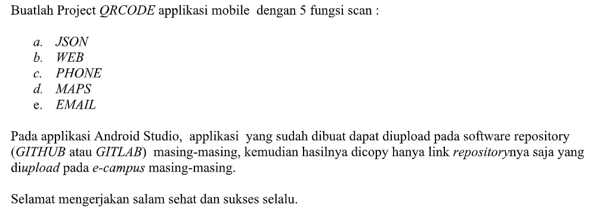
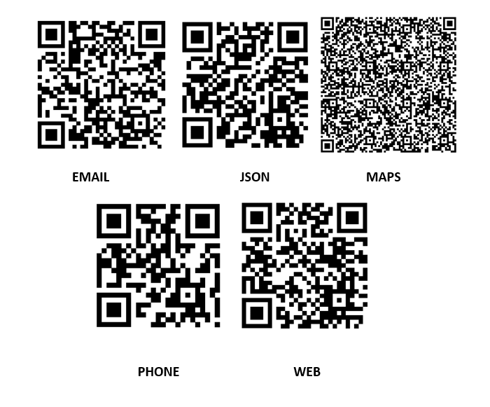
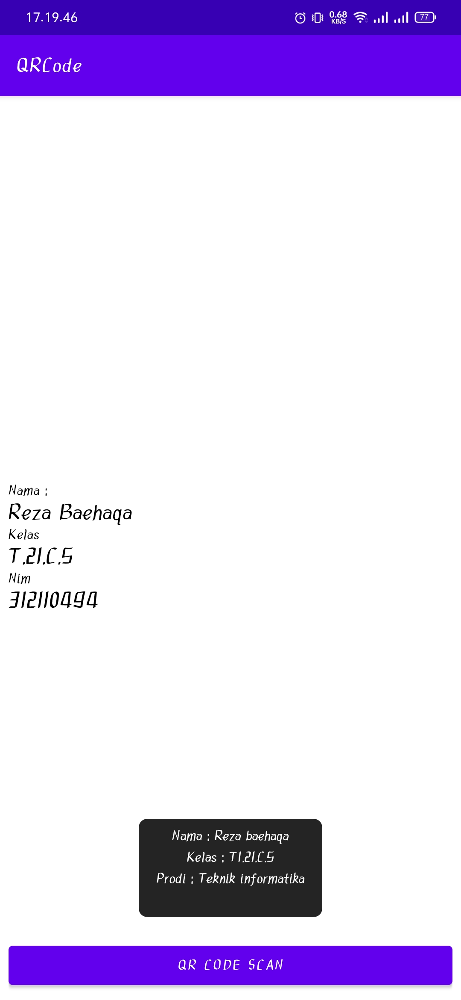
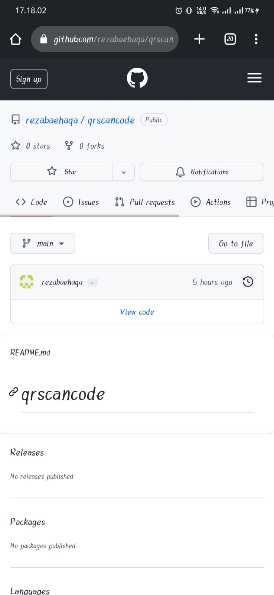
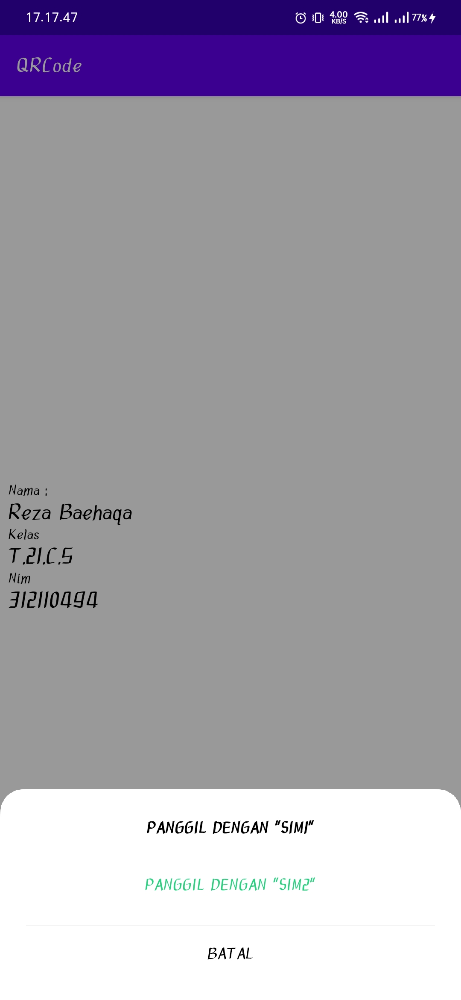
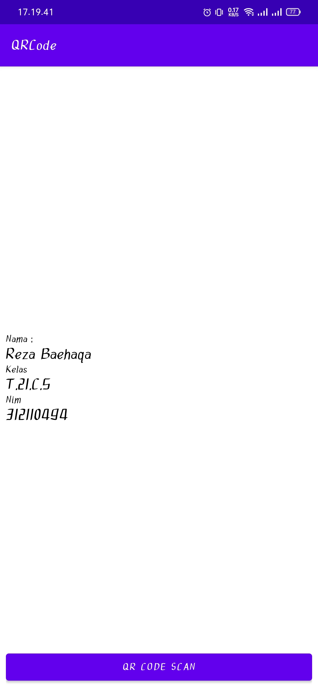
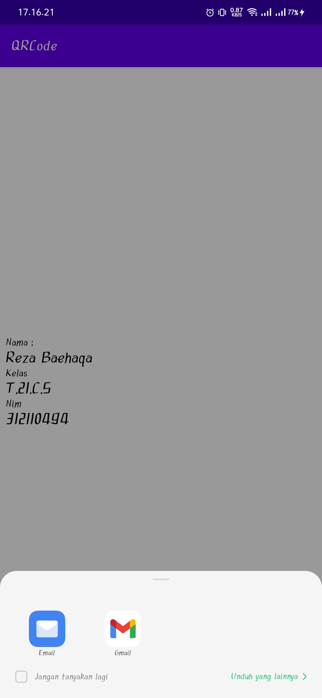
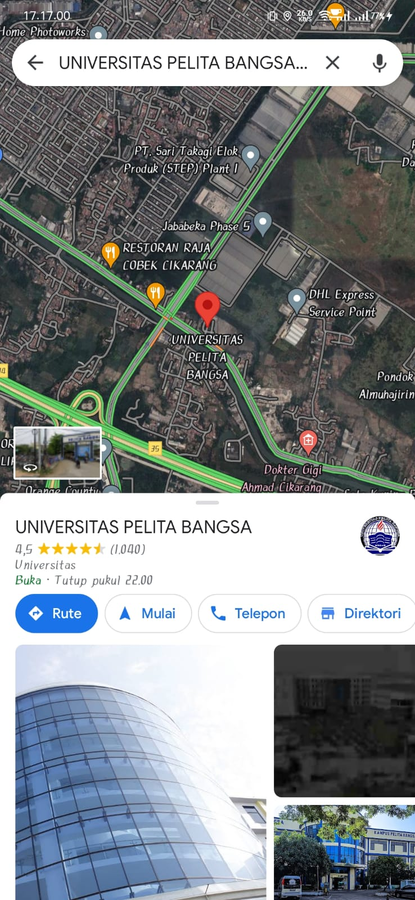

# Project scanner barcode
```sh
Nama    : A. Reza Baehaqa Jamroni
Nim     : 312110494
Matkul  : Pemrograman mobile
```
### Project explanation
<p>

### Tentang aplikasi
Pada project kali ini yaitu membuat aplikasi Barcode scanner atau barcode reader adalah aplikasi yang mampu membaca informasi di dalam barcode.<p>
Kode batang atau barcode adalah gambar yang mengandung deretan garis vertikal berwarna hitam dan putih dengan ketebalan berbeda-beda. Deretan garis ini merupakan kumpulan kode yang menyimpan informasi suatu produk seperti harga atau jenisnya Kode ini hanya bisa dibaca melalui alat bernama barcode scanner atau aplikasi yang kita bikin ini.<p>
adapun scanner barcode kali ini terdapat 5 fungsi scan yang terdiri dari : <p>
* JSON
* WEB
* PHONE
* MAPS
* EMAIL

### Barcode
Adapun di bawah ini adalah barcode yang saya bikin menggunakan qr generator
<p>

### output project
berikut dibawah ini adalah contoh hasil trial atau percobaan aplikasi qr scanner barcode yang saya bikin dengan output dibawah ini<p>
<p>
<p>
<p>
<p>
<p>
<p>

